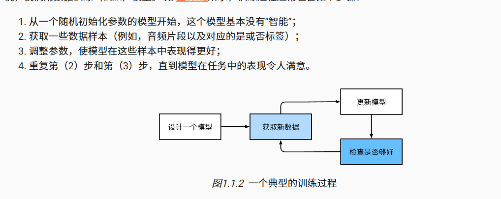

# 机器学习

一类强大的可已从经验中学习的技术，通常采用观测数据或与环境交互的形式。

## 日常生活中的机器学习

- hey siri！

定义一个灵活的程序算法，输出由许多参数(parameter)决定，然后使用数据集来决定当下最佳参数集。

学习 就是一个训练模型的过程。

## 机器学习中的核心组件

1. 用于学习的数据data
2. 转换数据的模型model
3. 用于量化模型的有效性的目标函数
4. 调整模型参数以优化目标函数的算法

### 数据

数据集由一个个样本组成，数组大多时候遵循独立同分布，每个样本由一组称为特征（协变量）的属性组成。 机器学习模型会依据这些属性进行预测。

要预测的属性被称为标签（label或目标target）

当每个样本特征类别数量都相同时，其特征向量是固定长度的，被称为数据的维度，是一个方便属性，用于量化学习大量样本。

有些数据则不是固定长度，方法1：建材城标准尺寸（有局限，可能丢失信息）

与传统机器学习方法相比，深度学习的主要优势是可以处理不同长度的数据。

数据越多，工作越容易。

数据需要在海量的基础上保证正确性，也要均衡，如皮肤癌训练集中各色皮肤的人都需要有数据。

## 模型

深度学习与经典方法的区别主要在于：前者关注的是功能更为强大的模型，由神经网络错综复杂地交织在一起，包含层层数据转换。（多层神经网络？）

## 目标函数

用于度量模型的优劣程度。 （可优化程度）

因为越低越好，该函数也被称为损失函数。

常见损失函数：

1. 平方误差（多用于预测数值）
2. 最小化错误率（预测与实际情况不符的样本比例，多用于分类问题）

可用数据集通常可以分成两部分：训练数据集用于拟合模型参数，测试数据集用于评估拟合的模型。

### 过拟合

在训练集上表现良好，出了数据集就表现差，不能推广到测试集。

## 优化算法

用于搜索调整出最佳参数，以最小化损失函数。

基本方法：梯度下降

在每个步骤中，梯度下降会检查每个参数，检查该参数变化后训练集的损失移动方向，从而优化参数。

## 机器学习问题

### 监督学习

在“给定输入特征”的情况下预测标签，目标是生成一个模型，将任何输入特征映射到标签（预测）。

具体的例子： 假设我们需要预测患者的心脏病是否会发作，那么观察结果“心脏病发作”或“心脏病没有发作”将是样本的标签。 输入特征可能是生命体征，如心率、舒张压和收缩压等。

监督学习之所以能发挥作用，是因为在训练参数时，我们为模型提供了一个数据集，其中每个样本都有真实的标签。

监督学习三大步骤：

1. 从已知大量数据样本中随机选取一个子集，为每个样本获取真实标签。有时，这些样本已有标签（例如，患者是否在下一年内康复？）；有时，这些样本可能需要被人工标记（例如，图像分类）。这些输入和相应的标签一起构成了训练数据集；
2. 选择有监督的学习算法，它将训练数据集作为输入，并输出一个“已完成学习的模型”；
3. 将之前没有见过的样本特征放到这个“已完成学习的模型”中，使用模型的输出作为相应标签的预测。

#### 回归

当标签取任意数值时，我们称之为回归问题。

判断回归问题的一个很好的经验法则是，任何有关“有多少”的问题很可能就是回归问题。

#### 分类

“哪一个” “哪一种” 问题，则为分类。

#### 标记问题

学习预测不相互排斥的类别的问题称为*多标签分类*（multi-label classification）。 举个例子，人们在技术博客上贴的标签，比如“机器学习”“技术”“小工具”“编程语言”“Linux”“云计算”“AWS”。 一篇典型的文章可能会用5～10个标签，因为这些概念是相互关联的。 关于“云计算”的帖子可能会提到“AWS”，而关于“机器学习”的帖子也可能涉及“编程语言”。

#### 搜索

在信息检索领域，对一组项目进行排序。

可能的解决方案：首先为集合中的每个元素分配相应的相关性分数，然后检索评级最高的元素。

#### 推荐系统

向特定用户进行”个性化“推荐 

#### 序列学习

输入的数据是连续的，模型需要”记忆“功能。

序列学习需要摄取输入序列或预测输出序列，或两者兼而有之。 

具体来说，输入和输出都是可变长度的序列，例如机器翻译和从语音中转录文本。

### 无监督学习

数据中不含有“目标”的机器学习问题通常被为*无监督学习*（unsupervised learning）

### 与环境互动

不管是监督学习还是无监督学习，我们都会预先获取大量数据，然后启动模型，不再与环境交互。 这里所有学习都是在算法与环境断开后进行的，被称为*离线学习*（offline learning）。

考虑“与真实环境互动”将打开一整套新的建模问题。

### 强化学习

在强化学习问题中，智能体（agent）在一系列的时间步骤上与环境交互。 在每个特定时间点，智能体从环境接收一些*观察*（observation），并且必须选择一个*动作*（action），然后通过某种机制（有时称为执行器）将其传输回环境，最后智能体从环境中获得*奖励*（reward）。 此后新一轮循环开始，智能体接收后续观察，并选择后续操作，依此类推。

在强化学习中，我们并不假设环境告诉智能体每个观测的最优动作。 一般来说，智能体只是得到一些奖励。 此外，环境甚至可能不会告诉是哪些行为导致了奖励。

## 小结

